<center>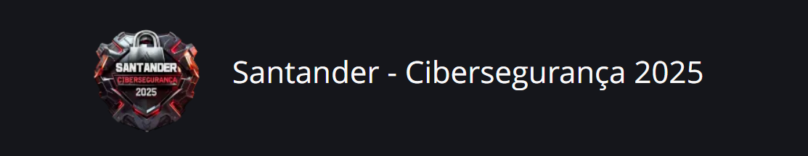</center>

### Wandeilson Ferreira


## Índice

- [Descrição do desafio](#Descrição-do-desafio)
- [Configuração dos ambientes virtuais](#Configuração-dos-ambientes-virtuais)
- [Práticas](#Práticas)
- [Medidas de Segurança Contra Ataques de Força Bruta](#Medidas-de-Segurança-Contra-Ataques-de-Força-Bruta)

## Descrição do desafio
O presente desafio simulará alguns cenários de ataques de força bruta em ambientes de testes para exercitar medidas de ataque e prevenção.

## Configuração dos ambientes virtuais

[VirtualBox](https://www.virtualbox.org/)

VirtualBox é um software de virtualização gratuito e de código aberto desenvolvido pela Oracle, que permite criar e executar máquinas virtuais em seu computador. Com ele, é possível simular diferentes sistemas operacionais — como Linux, Windows ou macOS — dentro do seu sistema principal, sem precisar fazer alterações físicas no hardware. É amplamente utilizado para testes, desenvolvimento e aprendizado, especialmente em ambientes de segurança da informação.

[Kali Linux](https://www.kali.org/get-kali/#kali-virtual-machines)

Kali Linux é uma distribuição do sistema operacional Linux voltada para testes de penetração e auditoria de segurança. Desenvolvido pela Offensive Security, ele vem pré-instalado com centenas de ferramentas especializadas para análise forense, engenharia reversa, escaneamento de redes e exploração de vulnerabilidades. É amplamente utilizado por profissionais de cibersegurança e entusiastas para simular ataques e fortalecer defesas.


[Metasploitable 2](https://sourceforge.net/projects/metasploitable/)

Metasploitable é uma máquina virtual propositalmente vulnerável, criada para fins educacionais e de treinamento em segurança cibernética. Ela é usada como alvo em testes de penetração, permitindo que usuários pratiquem técnicas de invasão de forma segura e controlada. Quando combinada com o Kali Linux no VirtualBox, forma um ambiente ideal para simulações de ataques e aprendizado prático sobre exploração de falhas.


> Para a atividade serão criados duas maquinas no VirtualBox: Kali Linux - Responsável pelos ataques e Metasploitable 2 - maquina alvo. 

<br>
<center>

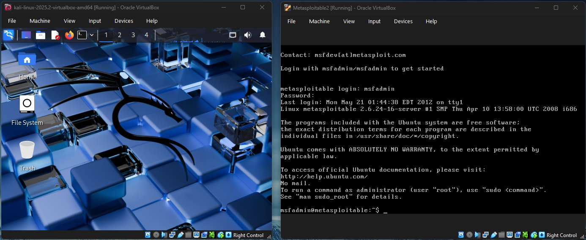
<figcaption>Maquinas de testes</figcaption>

</center>
<br>

> Vale salientar que o ambiente de teste será executado em um rede interna (host-only), previamente configurada no VirtualBox.

## Práticas

### Enumeração de serviços e portas com Nmap

**Nmap (Network Mapper)** é uma poderosa ferramenta de código aberto usada para varredura e auditoria de redes. Ela permite identificar dispositivos conectados, descobrir portas abertas, detectar serviços em execução e até encontrar vulnerabilidades em sistemas.

```
# Verificando o endereço da rede: 
ip a

# Verificando os hosts ativos na rede:
nmap -sn 192.168.56.0/24

# Verificando portas:
nmap -sV -p 21,22,80,445,133,168,36,162 192.168.56.102

```

#### Explicação dos Parâmetros
- -sV: ativa a detecção de versão dos serviços nas portas abertas. Isso permite identificar qual software está rodando e qual sua versão.
- -sn: realiza uma varredura ping (sem escanear portas), apenas para descobrir quais dispositivos estão ativos.
- -p 21,22,80,445,133,162,168,36,162: especifica um conjunto de portas para escanear. 
- 21: FTP (transferência de arquivos)
- 22: SSH (acesso remoto seguro)
- 80: HTTP (navegação web)
- 445: SMB (compartilhamento de arquivos no Windows)
- As demais (133, 162, 168, 36) estão associadas a serviços específicos ou personalizados.

<br>
<center>

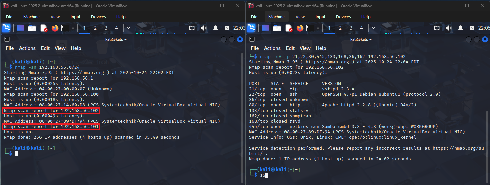
<figcaption>Teste de hosts ativos (esquerda), verificando portas e serviços (direita) </figcaption>

</center>
<br>


### Tentativa de conexão FTP 

Ao analisar o retorno do Nmap, identificamos diversas portas abertas e serviços potencialmente vulneráveis. Para este exemplo, focaremos no serviço FTP, já que a porta correspondente (21) está acessível.

#### Identificação de Vulnerabilidades
Após verificar a versão do serviço FTP em execução, realizamos uma consulta no site [Exploit database](https://www.exploit-db.com/), onde encontramos diversas vulnerabilidades conhecidas que podem ser exploradas em ambientes de teste controlado.

<br>
<center>

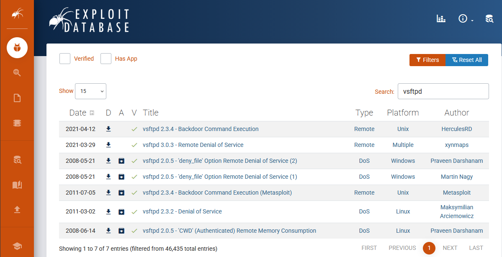
<figcaption>Verificando a vulnerabilidade no Exploit database </figcaption>

</center>
<br>

#### Conexão via FTP com a vítima

Para esta atividade, realizaremos uma conexão com a máquina alvo com o objetivo de obter privilégios elevados e assumir o controle do sistema em ambiente de teste.

``` 
# Conexão via FTP
ftp 192.168.56.102
```

<br>
<center>


<figcaption>Falha na conexão. Erro nas credências de acesso. </figcaption>

</center>
<br>

Para realizar um teste de força bruta em um serviço como FTP, podemos utilizar a ferramenta Medusa, que é rápida, flexível e suporta diversos protocolos. Neste exemplo, vamos focar no serviço FTP e utilizar uma wordlist personalizada com possíveis senhas.

#### Criação de wordlists de usuários e senhas

``` 
# Criando uma wordlist para users:
echo -e "user\nmsfadmin\nadmin\nroot" > users.txt

# Criando uma wordlist para senhas:
echo -e "123456\npassword\nqwerty\nmsfadmin" > pass.txt
```

#### Ataque de força bruta no FTP com Medusa
```
# Utilizando o medusa:
medusa -h 192.168.56.102 -U users.txt -P pass.txt -M ftp -t 6
```


<br>
<center>

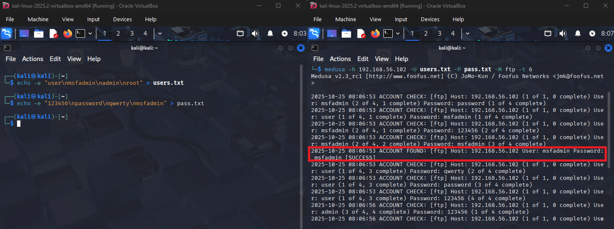
<figcaption> Criação de wordlists (esquerda), aplicando a Medusa (direita) </figcaption>

<br> 

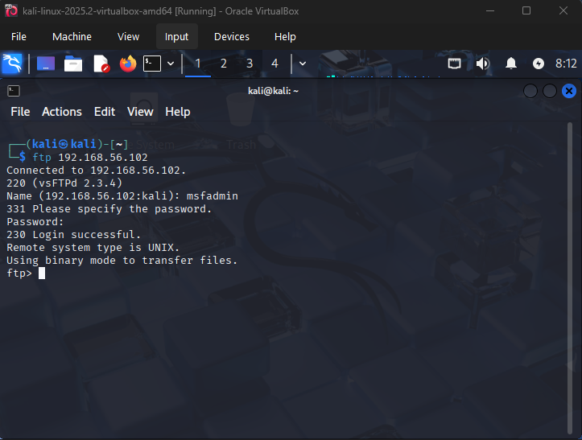
<figcaption>Conexão realizada com sucesso.</figcaption>

</center>
<br>

##### Explicação dos Parâmetros da Medusa
- -h: Define o host alvo, ou seja, o IP da máquina que está executando o serviço FTP.
- -U: Especifica o arquivo que contém a lista de usuários a serem testados. Cada linha do arquivo representa um nome de usuário.
- -P: Especifica o arquivo que contém a lista de senhas a serem testadas para cada usuário.
- -M: Define o módulo de serviço que será atacado. Neste caso, é o FTP. Medusa suporta vários protocolos (SSH, HTTP, SMB, etc.).
- -T: Define o número de threads simultâneas. Isso permite que Medusa teste até 6 combinações ao mesmo tempo, acelerando o processo.


### Ataques de força bruta aplicados em formulários de login em sistemas web
Ataques de força bruta em formulários de login de sistemas web consistem em tentativas automatizadas de adivinhar credenciais de acesso — como nome de usuário e senha — por meio da repetição exaustiva de combinações possíveis até encontrar a correta. Esse tipo de ataque explora falhas de segurança como ausência de bloqueio após múltiplas tentativas ou senhas fracas, podendo comprometer a integridade do sistema e expor dados sensíveis. 


#### DVWA
O DVWA (Damn Vulnerable Web Application) é uma aplicação web propositalmente vulnerável, criada para fins educacionais e de testes de segurança, permitindo que profissionais e estudantes pratiquem técnicas como força bruta, injeção de SQL e XSS em um ambiente controlado, contribuindo para o aprendizado e aprimoramento de medidas defensivas.


##### Acessando o DVWA
Para ter acesso a ferramenta devemos utilizar o seguinte endereço IP: https://<ip_vitima>/dvwa/login.php em um navegador web.

<br>
<center>

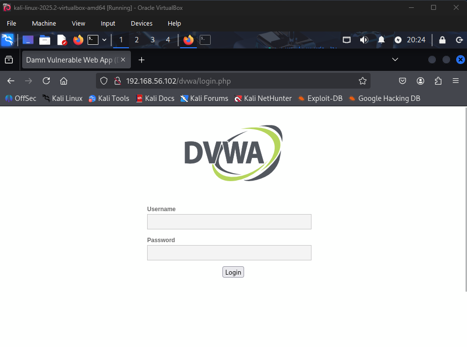
<figcaption> Interface DVWA </figcaption>

</center>

<br> 

Ao inspecionar a página podemos observar o Request de erro de login para pegarmos o status de erro para comparar nos nos demais testes de acesso.

<br>
<center>

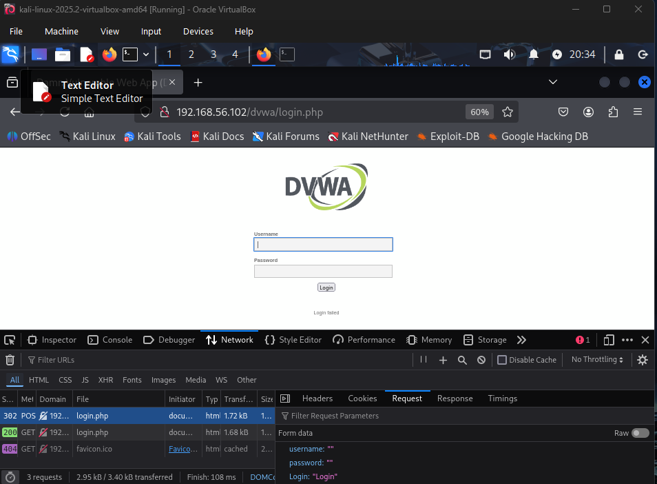
<figcaption> Inspecionando o  DVWA </figcaption>

</center>

<br> 

#### Criação de wordlists de usuários e senhas

``` 
# Criando uma wordlist para users no kali:
echo -e "user\nmsfadmin\nadmin\nroot" > users.txt

# Criando uma wordlist para senhas:
echo -e "123456\npassword\nqwerty\nmsfadmin" > pass.txt
```

<br>

<center>

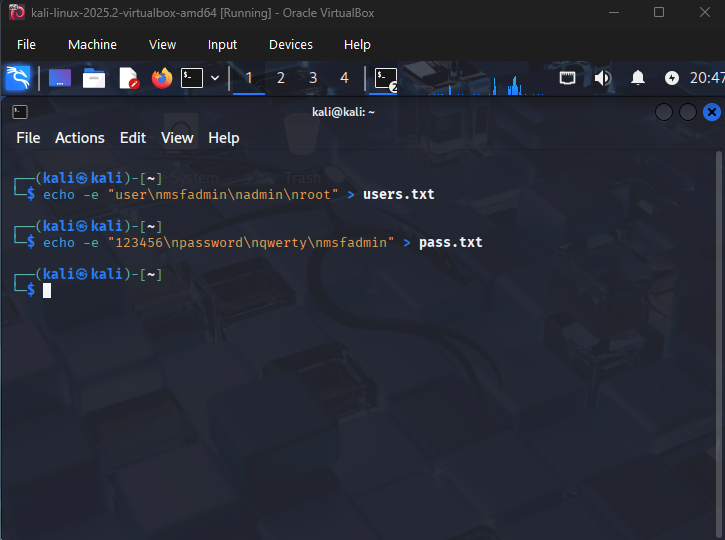

<figcaption> Criação das wordlists </figcaption>

</center>

<br> 

#### Utilizando o Medusa para simular combinações entre usuários e senhas

```
medusa -h 192.168.56.102 -U users.txt -P pass.txt -M http \
-m PAGE:'/dvwa/login.php' \
-m FORM: 'username=^USER^&password=^PASS^&Login=Login' \
-m 'FAIL-Login failed' -t 6
```

<br>

<center>

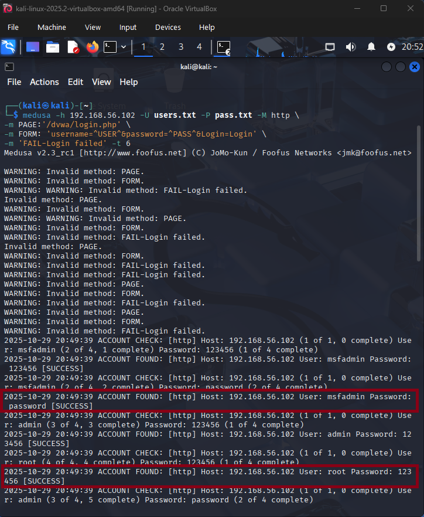

<figcaption> Ataque de força bruta com o Medusa </figcaption>

<br>

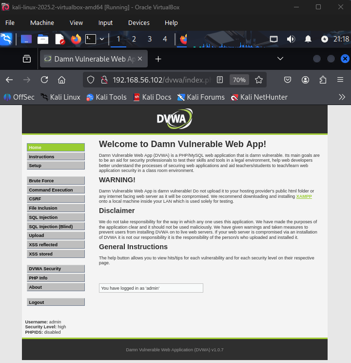

<figcaption> Login efeuado com sucesso </figcaption>

</center>

<br> 

 

### Ataque em cadeia, enumeração smb + password spraying 
O protocolo SMB (Server Message Block) é um sistema de comunicação usado para compartilhar arquivos, impressoras e outros recursos entre dispositivos em uma rede.
Ele permite que computadores conectados a uma mesma rede local acessem e manipulem arquivos como se estivessem armazenados localmente. Originalmente desenvolvido pela IBM e amplamente adotado pela Microsoft, o SMB é essencial para ambientes corporativos e domésticos que utilizam sistemas Windows, embora também seja compatível com outros sistemas operacionais como Linux e Unix.

#### Identificando portas e serviços vulnerávies 
```
# Verificando portas:
nmap -T0 -sS -Pn -p- 192.168.56.102

```

##### Explicação dos parâmetros:
- -T0: usa a velocidade mais lenta e menos detectável (modo "paranoid").
- -sS: realiza uma varredura SYN (stealth scan), que é menos visível para sistemas de detecção.
- -Pn: evita o ping inicial, útil para hosts que bloqueiam ICMP.
- -p 445: define a porta a ser escaneada

<br>

<center>

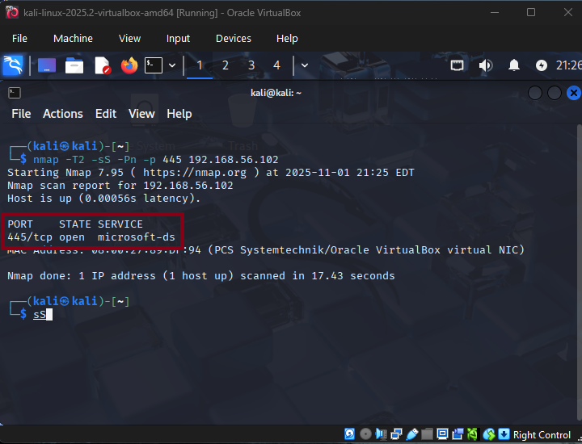

<figcaption> Verificando os serviços com Nmap </figcaption>

</center>

<br> 

Para a atividade iremos utilizar a técnica de **password spraying** que consistem em um tipo de ataque cibernético em que o invasor tenta uma ou poucas senhas comuns em várias contas diferentes, evitando bloqueios por tentativas repetidas.

Diferente do ataque de força bruta tradicional — que tenta várias senhas em uma única conta até acertar — o spraying busca explorar senhas fracas ou previsíveis (como “123456” ou “Senha@123”) em um grande número de usuários. Essa abordagem é eficaz porque evita os mecanismos de bloqueio por múltiplas tentativas falhas, já que cada conta é testada apenas uma ou poucas vezes. É comum que os atacantes usem listas de senhas padrão ou senhas que seguem padrões corporativos previsíveis, como “Empresa@2024”.


##### Enumeração de usuarios para protocolo smb
```
# Enumeração de usuarios para o protocolo smb
enum4linux -a 192.168.156.102 | tee enum4_output.txt
```

<br>

<center>

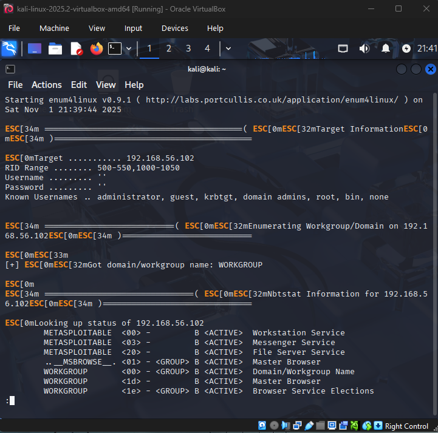

<figcaption> Resultados da enumeração </figcaption>

</center>

<br> 

##### testando acesso utilizando smbclient
```
# Acessando a maquina da vitima
smbclient -L //<ip_vitima> -U msfadmin
``` 

<br>

<center>

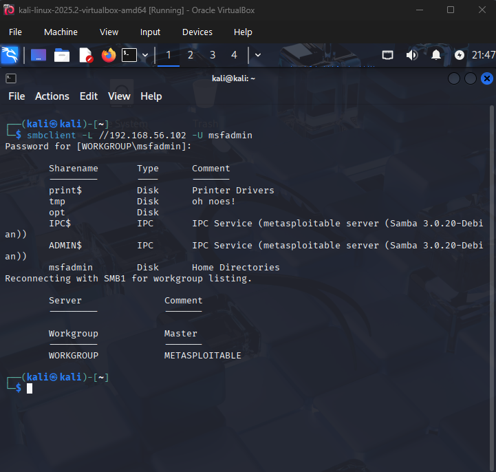

<figcaption> Acesso a maquina via smbcliente </figcaption>

</center>

<br> 


## Medidas de Segurança Contra Ataques de Força Bruta

Para proteger sistemas contra ataques de força bruta, é fundamental adotar uma abordagem preventiva e estratégica. Primeiramente, deve-se desativar serviços desnecessários, reduzindo a superfície de ataque e limitando os pontos de entrada. Além disso, é essencial utilizar protocolos modernos e seguros, como SSH em vez de Telnet, garantindo a criptografia dos dados transmitidos. A implementação de senhas fortes e complexas dificulta a adivinhação por meio de tentativas automatizadas. Por fim, a configuração de mecanismos de bloqueio após um número limitado de tentativas de login ajuda a mitigar ataques persistentes, interrompendo o acesso de agentes maliciosos após sucessivas falhas de autenticação. Essas medidas, combinadas, fortalecem significativamente a segurança do ambiente.

# Cybersecurity
